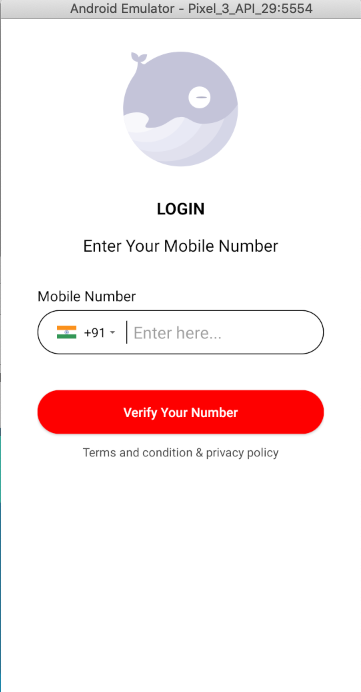
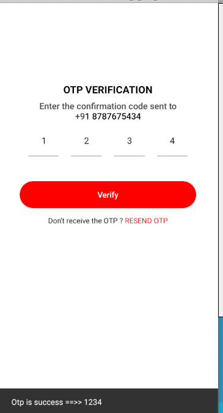
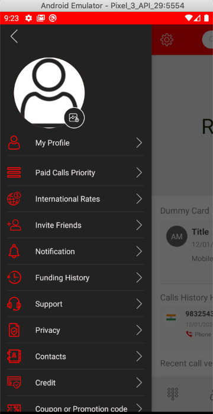
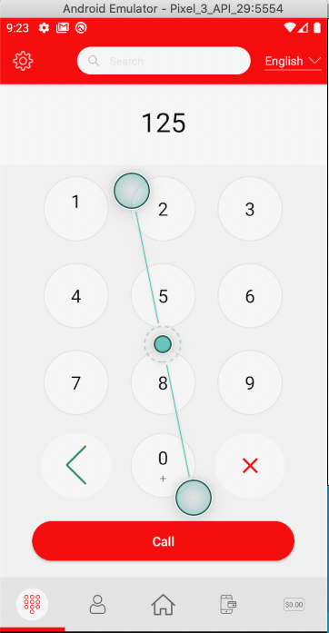
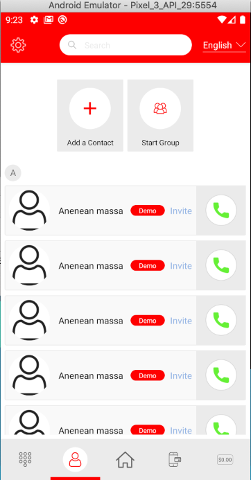
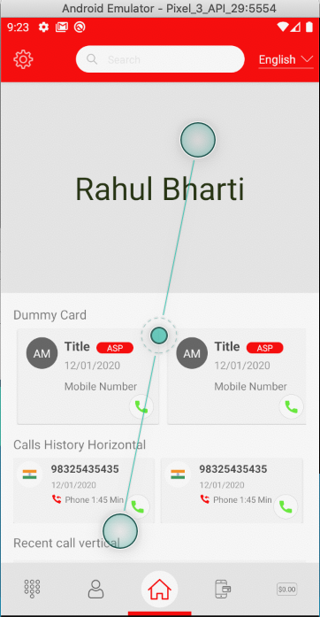

# Demo is a dummy project for android.

# Okay let me do explain it in **brief**
I've craeted lot of screens in this project like splash, SignIn , otp, Homepage , custome keyboard, contact list abd navigation etc and have used lottie also

# I hope, It will be helpfull for beginers

# Screens

      
     

# Lottie Screen
I've used lottie in the signin screen it will not be appeared on it, Whenever you will be downloading this project then either run on device or emulator,
So it will be show, You will be able to see lottie animation.

 

# Lottie Library
    def lottieVersion = "3.4.0"
    implementation "com.airbnb.android:lottie:$lottieVersion"

# I have used network call api using retrofit and coroutine using MVVM architecture,
 Retrofit
    implementation 'com.squareup.retrofit2:retrofit:2.9.0'
    implementation 'com.google.code.gson:gson:2.8.5'
    implementation 'com.squareup.retrofit2:converter-gson:2.9.0'
    implementation 'com.squareup.okhttp3:logging-interceptor:4.7.2'

# Coroutine
    implementation 'org.jetbrains.kotlinx:kotlinx-coroutines-android:1.3.7'
    
   

